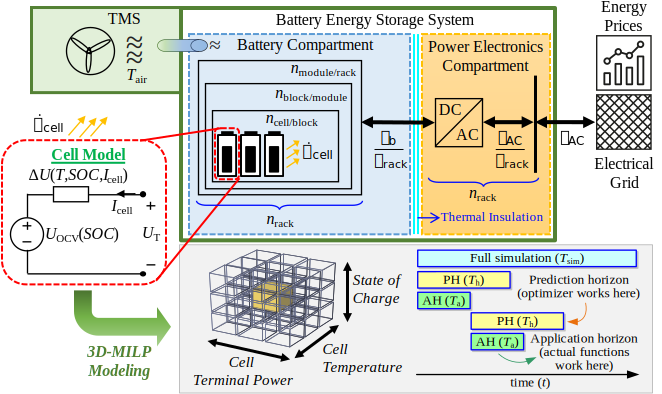

<p align="center">
  
</p>

# Energy Arbitrage Optimization With Battery Storage: 3D-MILP for Electro-Thermal Performance and Semi-Empirical Aging Models


The tool was created by [Volkan Kumtepeli](https://scholar.google.com/citations?user=Z43mRIsAAAAJ&hl=en) at the Energy Research Institute at Nanyang Technological University
in collaboration with Institute for Electrical Energy Storage Technology at the Technical University of Munich.


## How to cite: 

V. Kumtepeli, HC. Hesse, M. Schimpe, A. Tripathi, Y. Wang, and A. Jossen,
Energy Arbitrage Optimization With Battery Storage: 3D-MILP for Electro-Thermal Performance and Semi-Empirical Aging Models.
IEEE Access, vol. 8, pp. 204325-204341, 2020. [Online]. Available:
https://doi.org/10.1109/ACCESS.2020.3035504

```
@article{kumtepeli2020energy,
  title={Energy Arbitrage Optimization With Battery Storage: 3D-MILP for Electro-Thermal Performance and Semi-Empirical Aging Models},
  author={Kumtepeli, Volkan and Hesse, Holger C and Schimpe, Michael and Tripathi, Anshuman and Youyi, Wang and Jossen, Andreas},
  journal={IEEE Access},
  volume={8},
  pages={204325--204341},
  year={2020},
  publisher={IEEE}
  doi={10.1109/ACCESS.2020.3035504},
  ISSN={2169-3536},
}

```


## Dependencies / Requirements: 

* [Gurobi](https://www.gurobi.com/) 9.03
* [YALMIP](https://yalmip.github.io/download/) R20200116
* MATLAB >=2017a for string operations and >=2019a for readmatrix function.
* [Robust Statistical Toolbox](https://github.com/CPernet/Robust_Statistical_Toolbox) (not used but may be necessary for some functions in RainCloudPlots library) 
* Partially provided external libraries: 
  - [RainCloudPlots](https://github.com/RainCloudPlots/RainCloudPlots)
  - [cbrewer](https://www.mathworks.com/matlabcentral/fileexchange/34087-cbrewer-colorbrewer-schemes-for-matlab)
  - [Custom Colormap](https://www.mathworks.com/matlabcentral/fileexchange/69470-custom-colormap)
  - [MATLAB-Dataspace-to-Figure-Units](https://github.com/michellehirsch/MATLAB-Dataspace-to-Figure-Units)
  - [Tight Subplot](https://www.mathworks.com/matlabcentral/fileexchange/27991-tight_subplot-nh-nw-gap-marg_h-marg_w)


## How to use: 

Run Optimization_single.m or Optimization_batch.m file. Default settings are given in simulationSettings which can be called with additional settings.